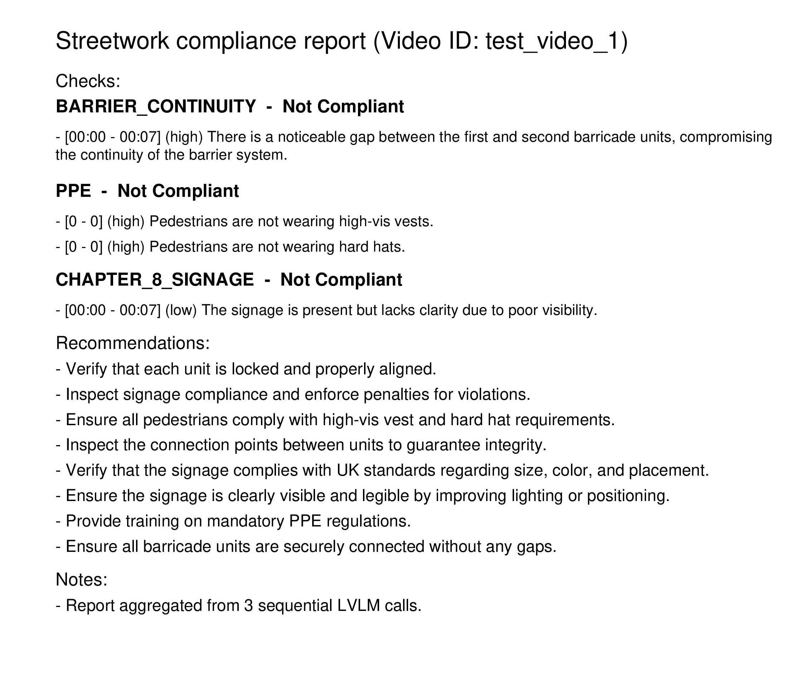

# **Street Works Compliance using Cosmos Reason-2**

## Overview

This project explores whether a reasoning-oriented vision-language model can support structured compliance-style inspection tasks on street-works video.

Rather than implementing full regulatory compliance, the current pipeline runs three focused visual checks and aggregates them into an audit-style output package.

The script `scripts/generate_site_compliance_report.py` performs:

1. **Barrier Continuity Check**
2. **PPE Compliance Check**
3. **Chapter 8 Signage Check**

Each check is executed as a separate model invocation, then merged into one consolidated JSON + PDF report with evidence frames.

> Note:
>
> The accompanying notebook contains a more detailed discussion of the motivation, reasoning hypothesis, prompt design considerations, implementation trade-offs, and observed behaviors. The notebook documents the exploratory workflow.
> barrier_continuity_assessment.ipynb


## Scope

Street-works compliance spans many contextual rules. Full end-to-end compliance against documents such as [Safety at Street Works and Road Works (UK Red Book)](https://assets.publishing.service.gov.uk/media/5a7d8038e5274a676d532707/safety-at-streetworks.pdf) is intentionally out of scope.

This implementation focuses on three representative checks:

### 1) Barrier Continuity
Detects visible issues such as:
- Gaps between adjacent barriers
- Missing or detached barrier connections
- Breaks in the continuous boundary around the works area

### 2) PPE Compliance
Checks whether visible people appear to be wearing:
- High-visibility upper-body PPE (vest/jacket)
- Hard hats

### 3) Chapter 8 Signage
Checks for visible warning-sign presence and placement quality, including obvious missing/mis-positioned signage risks.

## Approach

### Prompt-Driven, Modular Inference

No fine-tuning is used. Compliance logic is encoded via prompt design.

Instead of one monolithic prompt, the pipeline uses **three focused prompts** and runs them sequentially:

1. Barrier continuity prompt
2. PPE prompt
3. Chapter 8 signage prompt

This modular structure reduces reasoning overload on smaller models and improves output consistency per rule domain.

### Post-Processing Pipeline

After the three model calls complete, outputs are merged into a single report object:

- Consolidated `checks` array (Barrier, PPE, Signage)
- Aggregated recommendations
- Consolidated key findings

Then the pipeline generates:

- Structured JSON report
- Evidence frame extraction (from model-requested timestamps)
- PDF report with findings and embedded evidence images

## Outputs
A run typically produces files in the selected output directory:

- `<video_id>_safety_report.json` (consolidated report)
- `<video_id>_safety_report.pdf` (human-readable report)
- `<video_id>_evidence_<CHECK_TYPE>_<timestamp>.png` (evidence frames)

## Demo 
### Input video


https://github.com/user-attachments/assets/48e416f4-99b4-40a2-aebb-08ce70f02cc2


### Report



## Repository Structure

```text
streetworks-compliance/
├── README.md
├── requirements.txt
├── outputs/
├── sample_data/
├── sample_output/
└── scripts/
    └── generate_site_compliance_report.py
    └── barrier_continuity_assessment.ipynb
    
```

## Run the Script

### Environment

Use a Python environment with dependencies from `requirements.txt`.
A GPU is recommended for practical inference speed.

### Command

```bash
python scripts/generate_site_compliance_report.py \
  --input sample_data/input_video.mp4 \
  --output outputs
```

### Arguments

- `--input` / `-i`: path to input video (required)
- `--output` / `-o`: output directory path (default: `outputs`)

## Reproducibility Notes

- Inference can vary slightly across runs due to generation dynamics.
- Prompt wording strongly affects check sensitivity/coverage.
- Sequential, rule-specific passes are generally more stable than one broad compliance prompt.

## Conclusion

This project demonstrates a practical **modular compliance-analysis pattern** for street-works video:

- Rule-specific LVLM passes (Barrier, PPE, Signage)
- Structured JSON aggregation
- Evidence-frame traceability
- PDF reporting for review workflows

